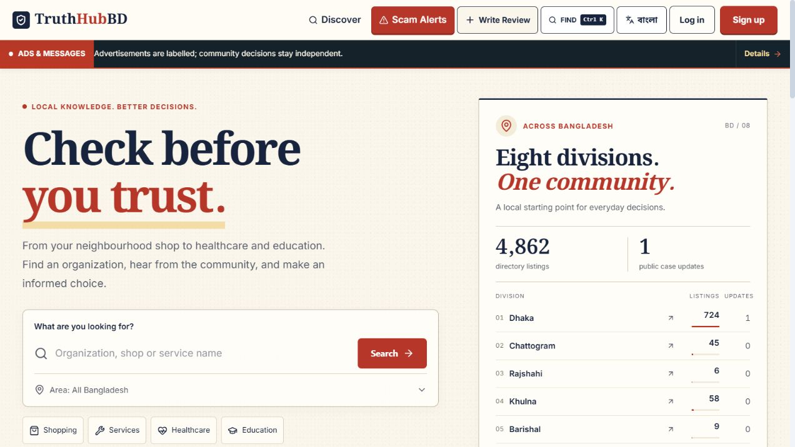
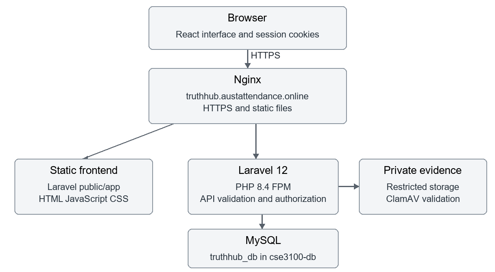
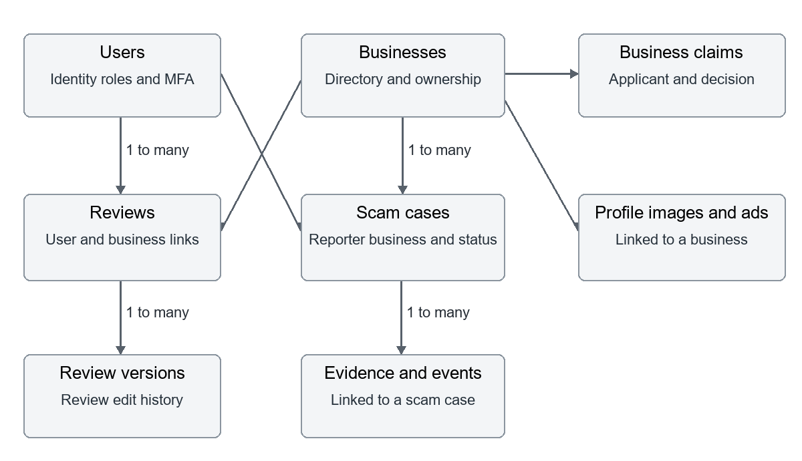
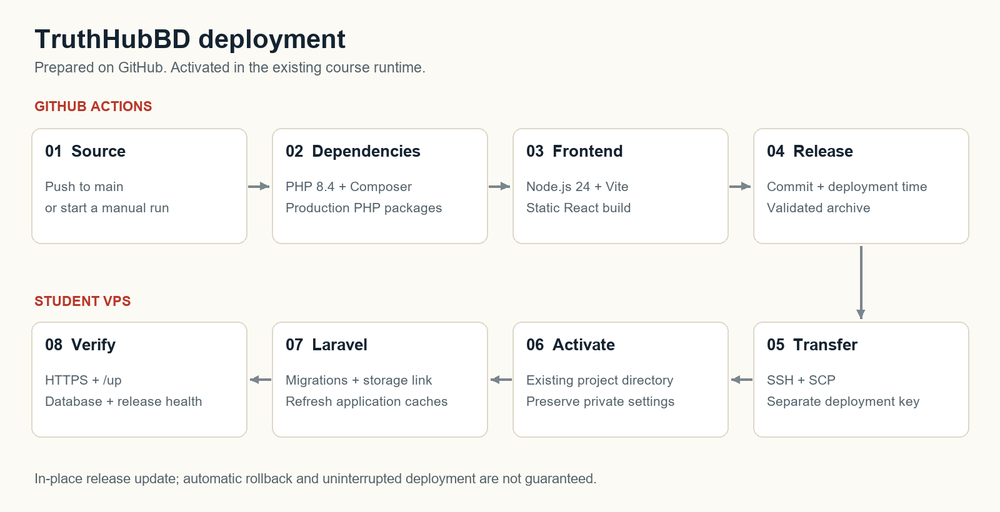

# 🛡️ TruthHubBD

### Check before you trust.

**Organization discovery · Community reviews · Moderated scam reports** 
**Built for Bangladesh, with Bengali and English interfaces.**

[**🌐 Live application**](https://truthhub.austattendance.online/) · [**💚 Health & release**](https://truthhub.austattendance.online/api/health) · [**🚀 Deployments**](https://github.com/faysaliqbal007/TruthHubBD/actions)

---

## 📖 Contents

| Project | Development | Operations |
| --- | --- | --- |
| [Overview](#overview) | [Local setup](#local-setup) | [Production runtime](#production-runtime) |
| [Features and roles](#features-and-roles) | [Configuration](#configuration) | [Deployment pipeline](#deployment-pipeline) |
| [Technology stack](#technology-stack) | [Google sign-in](#google-sign-in) | [Scanner maintenance](#scanner-maintenance) |
| [System architecture](#system-architecture) | [Testing](#testing) | [HTTPS maintenance](#https-maintenance) |
| [Repository layout](#repository-layout) | [API reference](#api-reference) | [Queues and retention](#queues-and-retention) |
| [Database design](#database-design) | [Security and file handling](#security-and-file-handling) | [Verification and troubleshooting](#verification-and-troubleshooting) |
| [Sources and attribution](#sources-and-attribution) | [Contributing](#contributing) | [Course project and team](#course-project-and-team) |

## 🌏 Overview

TruthHubBD is a community platform for discovering organizations and services in Bangladesh, reading and writing customer reviews, submitting ownership claims, and following reported incidents. It brings public directory information and community contributions together while keeping private evidence behind authorized application routes.

The platform separates source-attributed directory facts, customer experiences, ownership claims, and incident reports. A directory listing is not an endorsement or proof of ownership. A reported case is an allegation; platform review does not establish legal guilt.

| Resource | Address |
| --- | --- |
| Application | [https://truthhub.austattendance.online/](https://truthhub.austattendance.online/) |
| Database health and release information | [https://truthhub.austattendance.online/api/health](https://truthhub.austattendance.online/api/health) |
| Laravel availability check | [https://truthhub.austattendance.online/up](https://truthhub.austattendance.online/up) |
| Repository | [faysaliqbal007/TruthHubBD](https://github.com/faysaliqbal007/TruthHubBD) |

### Application preview

*Live homepage captured on 4 October 2026. Counts and content change as the application is updated.*

## ✨ Features and roles

### Application modules

| Module | What it provides |
| --- | --- |
| Organization discovery | Search by name, category, and location; organization profiles, maps, ratings, and customer reviews. |
| Reviews | Overall and service/value/communication ratings, supporting evidence, comments, reactions, editing history, and content reports. |
| Organization submissions | Community-created organizations and moderated profile-image submissions. |
| Ownership claims | Evidence-based claim submission and staff decisions before ownership access is granted. |
| Business center | Owner workflows, organization updates, and official responses to customer reviews. |
| Scam cases | Incident submissions, case updates, evidence, reporter and subject responses, moderation decisions, resolutions, and appeals. |
| Public case alerts | Administrative review and promotion of eligible cases; in-app notifications through a dedicated queue. |
| Community activity | Recent content, saved organizations, notifications, and activity feeds. |
| Advertising | Advertisements, ticker settings, sponsored placements, campaign controls, and event recording. |
| Staff workspace | Moderation queues, claims, organization images, reports, appeals, account controls, and audit history. |
| Account security | Email verification, password recovery, Google OAuth, account restrictions, and configurable staff authenticator checks. |
| Location support | Bangladesh administrative areas, map location selection, location search/resolution, and source-attributed coordinates. |
| Languages | Bengali and English interface dictionaries and publication rules for translated public content. |

### Access model

| Actor | Access |
| --- | --- |
| Visitor | Public discovery, visible organization profiles, reviews, public cases, advertisements, and directory data. |
| Verified member | Authenticated submissions, reviews, reactions, reports, saved organizations, notifications, and account tools, subject to restrictions. |
| Business account / approved owner | Ownership-dependent organization and official-response workflows. |
| Moderator | Authorized moderation operations, as enforced by the relevant controller. |
| Administrator | Administrative controls and decisions, subject to authorization and configured staff security requirements. |

The stored roles are `user`, `business`, `moderator`, and `admin`. Ownership is also checked against the organization; a role name alone does not grant ownership of every organization. Registration does not grant administrator access.

## 🧰 Technology stack

| Layer | Technology | Purpose |
| --- | --- | --- |
| Frontend UI | React 19 | Interactive application screens and components. |
| Type system | TypeScript 5.9 | Shared data types and frontend checks. |
| Build tool | Vite 8 | Frontend development tooling and static production builds. |
| Styling | Tailwind CSS 4 and application CSS | Utility styles and custom page layouts. |
| Icons and motion | Lucide React; Motion / Framer Motion packages | Interface icons and animation support. |
| Maps | MapLibre GL | Browser map components and location selection. |
| Backend | Laravel 12 | Web/API routes, validation, authorization, business logic, and operational commands. |
| ORM | Eloquent | Database models and relationships. |
| Authentication | Laravel Sanctum | Stateful session authentication for the application API. |
| Google OAuth | Laravel Socialite | Google authorization redirect and callback handling. |
| Staff authenticator | `pragmarx/google2fa` | TOTP enrollment and verification. |
| Database | MySQL | Production application data. |
| Test database | SQLite in memory | Isolated PHPUnit feature tests. |
| Password hashing | Laravel bcrypt configuration | Stored password hashes. |
| Mail | Laravel mail, SMTP/log transports | Verification and password recovery messages. |
| Jobs | Laravel database queues | Reviewed-case alert delivery. |
| Malware scanning | ClamAV 1.5.4 in the maintained bundle | Protected upload scanning with current definitions. |
| HTTP server | Nginx | HTTPS entry point and static file delivery. |
| PHP runtime | PHP 8.4-FPM | Application execution through a dedicated student socket. |
| Certificates | Let's Encrypt / ACME | HTTPS certificate issuance and renewal. |
| Automation | GitHub Actions | Application builds, SCP deployment, scanner updates, and certificate maintenance. |
| Backend tests | PHPUnit 11 | Laravel feature tests. |
| Frontend checks | TypeScript, Vite, Node.js test runner | Type checks, build checks, and selected helper tests. |

Exact dependency versions are recorded in [`frontend/package-lock.json`](frontend/package-lock.json) and [`backend/composer.lock`](backend/composer.lock).

<strong>Build/runtime distinction and additional tooling</strong>

The configured deployment uses `frontend/vite.config.ts` to produce a static frontend. Node.js is used on the GitHub runner; production requests are served by Nginx and PHP-FPM. A separate frontend Node.js server is not required on the VPS.

`frontend/package.json` also contains Next.js, Drizzle, Cloudflare/Wrangler, and related tooling. Their presence does not mean this VPS deployment runs a Next.js server, uses Drizzle as its production ORM, or hosts its backend on Cloudflare. Follow the actual Vite and Laravel workflow described here.

Docker is used by the scanner preparation script on GitHub to extract official ClamAV database resources. The VPS uses the course's existing shared database service; this repository does not provide an application Docker Compose deployment.

## 🏗️ System architecture

### Production components

The browser and backend share one production origin. Vite assets use the `/app/` base; Laravel handles API and web authentication routes. Nginx forwards PHP requests to the student's dedicated Unix socket instead of opening another application port.

### Backend request flow

**Request → Applicable middleware → Authorization and validation → Application logic → Database, storage, or queued work → Response.**

Public routes do not use the protected-route middleware stack. Controller checks further restrict staff actions, ownership, and private evidence access.

### Authentication flow

1. The client requests `/sanctum/csrf-cookie` before session-authenticated state changes.
2. Login/register requests go to Laravel web routes using cookies and the CSRF header.
3. Laravel establishes or updates the session; protected API calls use that session.
4. Verified-account, restriction, ownership, and staff checks apply according to the operation.
5. Google login redirects through `/auth/google/redirect`, returns to `/auth/google/callback`, and establishes a Laravel session before returning to the frontend.

### Frontend organization

- `frontend/src/main.tsx` mounts React; `src/App.tsx` loads the main application in `frontend/app/truthhub-app.tsx`.
- Components and page views implement discovery, submissions, account screens, business tools, and staff workflows.
- `src/services/` contains the fetch-based API and authentication services.
- `src/features/auth/` manages client authentication state.
- `src/i18n/` contains the language context and translation dictionaries.
- `src/lib/` contains helpers for URLs, locations, notifications, discovery parameters, and other UI behavior.

## 📁 Repository layout

| Path | Main contents |
| --- | --- |
| `frontend/app/` | Main UI and shared page styles |
| `frontend/src/` | Components, auth state, API services, language support, helpers, and types |
| `frontend/public/` | Static images, icons, and other assets |
| `frontend/tests/` | Frontend helper tests |
| `backend/app/` | Controllers, middleware, models, services, jobs, notifications, and commands |
| `backend/config/` | Application, database, session, mail, map, and security configuration |
| `backend/database/` | Migrations, factories, and seeders |
| `backend/public/` | Web root and generated `app/` assets |
| `backend/routes/` | API, authentication, frontend, and console routing |
| `backend/storage/` | Runtime files, uploads, and logs |
| `backend/tests/Feature/` | PHPUnit feature tests |
| `.github/scripts/` | Scanner and certificate automation helpers |
| `.github/workflows/` | Application deployment and maintenance workflows |
| `docs/screenshots/` | README preview and architecture images |

Installed dependencies, runtime environment files, and generated frontend builds are excluded from source control.

## 🗄️ Database design

Laravel migrations are the source of truth for the schema. The model called `Business` represents directory organizations and services as well as conventional businesses.

### Core relationships

This diagram shows the main relationships, not every schema column or table. Organization ownership is optional, and imports can remain unclaimed.

### Table groups

| Area | Tables | Purpose |
| --- | --- | --- |
| Accounts | `users`, `sessions`, `password_reset_tokens` | Identity, roles, sessions, verification/security fields, and password recovery. |
| Directory | `businesses`, `business_claims`, `business_profile_images` | Organization profiles, ownership decisions, and image publication review. |
| Reviews | `reviews`, `review_versions`, `review_comments`, `review_reactions`, `official_responses` | Experiences, editing history, discussion, reactions, and owner responses. |
| Cases | `scam_cases`, `scam_case_evidence`, `scam_case_events`, `appeals` | Incidents, private evidence, case history, and appeals. |
| Community | `content_reports`, `notifications`, `saved_entities` | Reports, notification inboxes, and bookmarks. |
| Advertising | `advertisements`, `advertisement_ticker_settings`, `sponsored_campaigns` | Creatives, ticker controls, and sponsored placements. |
| Locations | `admin_boundaries`, `entity_locations`, `geocoder_cache` | Administrative geography, organization coordinates, and cached location results. |
| Operations | `audit_logs`, `jobs`, `failed_jobs`, `cache`, `cache_locks` | Audit events, queued work, job failures, and cache infrastructure. |

JSON fields store structured information such as media metadata, translations, branches, and review snapshots. Sensitive paths and authentication fields are hidden from ordinary model serialization where defined. Public response helpers and controller authorization provide additional filtering.

## 💻 Local setup

### Prerequisites

| Requirement | Version / notes |
| --- | --- |
| PHP | 8.4 recommended to match deployment; application constraint is `^8.2`. |
| Composer | Composer 2; install from the committed lockfile. |
| PHP extensions | Dependencies required by `composer.lock`, including PDO MySQL; PDO SQLite for backend tests. CI also enables mbstring, bcmath, intl, gd, and zip. |
| Node.js | 24 to match CI; frontend declares `>=22.13.0`. |
| Database | MySQL with a project database and a dedicated local account. |
| Git | To clone and manage the repository. |
| ClamAV | Executable and current definitions to test file uploads. |

The steps below describe the Windows local setup. Use the corresponding file-copy and package-management operations on Linux/macOS. Application source code and private environment-file contents are intentionally excluded from this README.

### Step 1 — Clone

Clone the repository using its HTTPS address, then open the `TruthHubBD` project folder.

### Step 2 — Database and backend

Create a MySQL database named `truthhubbd` and grant a dedicated local user access to that database. Then, from the repository root:

Inside `backend/`, copy the example environment to a private local environment file, install the locked Composer dependencies, and generate an application key with Laravel Artisan.

Configure your private local backend environment as follows:

| Local setting | Value |
| --- | --- |
| Application environment | Local; debugging enabled |
| Application and frontend origins | `http://localhost:8000` |
| Database connection | MySQL on `127.0.0.1:3306`, database `truthhubbd` |
| Database credentials | Your dedicated local account; never copy production credentials into the README |
| Session storage | Database |
| Secure-only session cookies | Disabled for local HTTP |
| Stateful API host | `localhost:8000` |
| Mail transport | Log, for local verification and reset messages |

Keep the `APP_KEY` generated by Artisan. The example file currently uses port `8001`; this guide uses **8000** consistently, matching the Vite API proxy.

Apply the database migrations and create the public storage link using Laravel Artisan. Return to the repository root.

### Step 3 — Frontend dependencies and build

From the repository root:

Inside `frontend/`, install dependencies from the npm lockfile, copy the contents of `public/` into `backend/public/`, and run the production build. Return to the repository root.

Linux/macOS equivalent for copying static assets, while inside `frontend/`:

On Linux/macOS, copy the static asset directory contents into the Laravel web root as well; do not nest the frontend `public` directory inside it.

The build writes the application to `backend/public/app/`, with `/app/` as the asset base. The Vite configuration uses the current origin for API requests. The legacy `NEXT_PUBLIC_API_URL` in `frontend/.env.example` does not override this configured Vite value.

### Step 4 — Start and open

Inside `backend/`, start the Laravel development server on hostname `localhost`, port `8000`.

Open **[http://localhost:8000](http://localhost:8000)**. Laravel serves the built React application and API from one origin, including login and Google authentication routes. Rebuild frontend assets after editing frontend source.

<strong>Using Vite during frontend development</strong>

From `frontend/`, `npm run dev` starts Vite. The current proxy covers `/api` and `/sanctum` and targets `http://127.0.0.1:8000`.

Full authentication also uses web routes such as `/login`, `/register`, `/logout`, `/email/*`, and `/auth/google/*`. Those are not covered by the current proxy. Use the Laravel-served build for complete application testing, or configure those additional proxies together with matching origin, session, redirect, and stateful-domain settings before exercising authentication through Vite.

### Step 5 — Accounts and optional development data

Register through the application and verify the account using the local mail log or configured SMTP service. `MAIL_MAILER=log` writes messages to `backend/storage/logs/laravel.log` instead of sending email.

Optional fictional local/testing content can be previewed and then explicitly created, from `backend/`:

Use the `sample:community-content` Artisan command to preview optional fixtures. Add `--apply` only after review and only against a local/testing database.

Staff accounts require an authorized role assignment. Do not run the default `DatabaseSeeder` on production: it creates an administrator with a fixed development password and can reset an existing matching account.

## ⚙️ Configuration

Private runtime configuration belongs in `backend/.env`, not in repository secrets printed in documentation or committed source. Values below are configuration names and examples, not production credentials.

| Group | Variables | Use |
| --- | --- | --- |
| Application | `APP_NAME`, `APP_ENV`, `APP_KEY`, `APP_DEBUG`, `APP_URL`, `FRONTEND_URL` | Identity, environment, encryption key, URLs, debug behavior. |
| Database | `DB_CONNECTION`, `DB_HOST`, `DB_PORT`, `DB_DATABASE`, `DB_USERNAME`, `DB_PASSWORD` | Project database connection. |
| Sessions | `SESSION_DRIVER`, `SESSION_LIFETIME`, `SESSION_DOMAIN`, `SESSION_SECURE_COOKIE`, `SESSION_SAME_SITE` | Session persistence and cookie behavior. |
| Stateful API | `SANCTUM_STATEFUL_DOMAINS` | Hostnames/ports allowed for session-authenticated API requests. |
| Google | `GOOGLE_CLIENT_ID`, `GOOGLE_CLIENT_SECRET`, `GOOGLE_REDIRECT_URI` | OAuth client credentials and exact callback URI. |
| Mail | `MAIL_MAILER`, `MAIL_HOST`, `MAIL_PORT`, `MAIL_ENCRYPTION`, `MAIL_USERNAME`, `MAIL_PASSWORD`, `MAIL_FROM_ADDRESS`, `MAIL_FROM_NAME` | Log mail for local work or SMTP for real delivery. |
| Staff security | `STAFF_MFA_REQUIRED` | Require staff authenticator enrollment and session verification when true. |
| Scanner | `CLAMAV_BINARY` | Scanner executable or project wrapper path. |
| Queue | `QUEUE_CONNECTION` | Default job connection; reviewed-case broadcasts explicitly use database / `case-alerts`. |
| Cache/logging | `CACHE_STORE`, `LOG_CHANNEL`, `LOG_LEVEL` | Cache backend and application logging. |
| Mapping | `MAP_PROVIDER`, `MAP_STYLE_URL`, `MAP_DEFAULT_LAT`, `MAP_DEFAULT_LNG`, `MAP_DEFAULT_ZOOM` | Backend map configuration. |
| Geocoding | `GEOCODER_PROVIDER`, `NOMINATIM_BASE_URL`, `NOMINATIM_USER_AGENT`, `NOMINATIM_CONTACT_EMAIL`, `NOMINATIM_RATE_LIMIT`, `GEOCODER_CACHE_ENABLED`, `GEOCODER_CACHE_TTL` | Provider configuration and cached geocoding settings. |

Map defaults are defined in [`backend/config/map.php`](backend/config/map.php); the frontend location picker also defines its own tile sources. Backend map settings do not automatically replace every frontend tile configuration.

After backend environment changes:

Clear Laravel optimization/configuration caches after changing backend settings.

On production, refresh caches with `php artisan optimize`. Preserve the installation's existing `APP_KEY` across deployments.

## 🔑 Google sign-in

Use a Google OAuth client with application type **Web application**. Register the exact callback for each environment you use:

| Environment | Authorized redirect URI |
| --- | --- |
| Local setup in this guide | `http://localhost:8000/auth/google/callback` |
| Optional local setup using port 8001 | `http://localhost:8001/auth/google/callback` |
| Production | `https://truthhub.austattendance.online/auth/google/callback` |

Local configuration:

Keep the Google client ID and client secret in private backend configuration. Set the local callback to `http://localhost:8000/auth/google/callback`.

Production uses the HTTPS callback and live HTTPS origin for both `APP_URL` and `FRONTEND_URL`. If you choose port `8001` locally, update the server, app URLs, and relevant proxies consistently.

The callback scheme, hostname, port, and path must match the registered URI exactly. If the OAuth app is in testing mode, add the demonstration accounts as test users. Clear stale Laravel configuration after changing the backend settings.

The callback uses Socialite to obtain the Google account, create or link the corresponding user where allowed, mark its email verified, regenerate the session, and return to the frontend. A failed callback returns to login with an OAuth result indicator.

## 🔒 Security and file handling

| Control | Implementation |
| --- | --- |
| Session authentication | Laravel Sanctum and the web session guard. |
| CSRF protection | Laravel CSRF middleware; client obtains the XSRF cookie and sends the matching header. Password reset routes have explicit exceptions in bootstrap configuration. |
| Password storage | Laravel hashed cast with configured bcrypt hashing. |
| Email verification | Signed verification links and numeric code flows. |
| Rate limits | Route-level throttles for authentication, submissions, and selected public endpoints. |
| Restricted accounts | Middleware prevents restricted-account access to protected operations. |
| Staff authenticator | Configurable TOTP gate for admin/moderator sessions. |
| Authorization | Controller checks for roles, ownership, moderation access, and private evidence. |
| Sensitive serialization | Hidden password, authenticator, verification, and evidence-path fields where defined. |
| Public media | Visibility/publication helpers and consent/review fields; private evidence remains separate. |
| Audit trail | Application audit records, including scan-passed events and moderation/retention actions. |
| Production transport | Existing HTTPS site and secure session-cookie configuration. |

`STAFF_MFA_REQUIRED` defaults to false in source configuration. Set it to `true` to enforce staff enrollment and verification; do not assume it is enabled from the presence of authenticator screens alone.

### Upload processing

**Protected upload → Validate count and size → Scan the batch → Clean: continue to endpoint validation and storage; malware: HTTP 422; scanner error or stale definitions: HTTP 503.**

| Limit | Protected upload middleware |
| --- | --- |
| File count | Up to 20 files per request |
| Per-file size | Up to 10 MiB |
| Combined size | Up to 35 MiB |
| Scan timeout | 60 seconds in application configuration |
| Definition freshness | Reject definitions older than seven days |

Endpoints can impose additional size/type rules. A passing malware scan does not override those rules or grant publication approval. Public storage links must not expose the private evidence directory.

## 🧪 Testing

### Backend

From `backend/`:

For the complete backend feature suite, run the Artisan test command from `backend/`. Use the `HealthCheckTest` filter for the health response tests.

[`backend/phpunit.xml`](backend/phpunit.xml) configures PHPUnit, SQLite in-memory databases, array sessions/cache/mail, and testing-specific settings. Enable PDO SQLite locally. Tests cover authentication, discovery, claims, moderation, evidence, maps, advertising, notifications, security, health responses, and other application behavior.

### Frontend

From `frontend/`:

For the configured frontend checks, run the npm test script from `frontend/`.

The current test script runs TypeScript checks, a production build, and the selected Node.js helper tests listed in `package.json`.

| Command | Purpose |
| --- | --- |
| `npm run typecheck` | TypeScript check without emitting code. |
| `npm run build` | Production Vite build into Laravel's public app directory. |
| `npm run test:attachments` | Attachment helper tests. |
| `npm run test:i18n` | Language/content helper tests. |
| `npm run test:locations` | Bangladesh location-data tests. |
| `npm run test:videos` | Public video URL helper tests. |
| `npm run test:ads` | Advertisement helper tests. |

The deployment workflow builds and publishes the release but does **not** currently run these test suites. Run the checks before pushing application changes to `main`. A green deployment badge is not a complete test-suite result.

## 🖥️ Production runtime

| Component | Configuration |
| --- | --- |
| Operating system | Ubuntu 24.04 LTS course VPS |
| Student account | `s20230204112` |
| Application directory | `/home/s20230204112/laravel` |
| Web root | `/home/s20230204112/laravel/public` |
| Web server | Existing Nginx project virtual host |
| PHP-FPM socket | `/run/php/php8.4-fpm-s20230204112.sock` |
| Database host/port | `127.0.0.1:3307` |
| Application database | `truthhub_db` |
| Non-root database user | `truthhub` |
| Scanner directory | `/home/s20230204112/truthhub-scanner` |
| Public origin | `https://truthhub.austattendance.online` |

### Course infrastructure rules

- Use the instructor-provided Nginx, dedicated student PHP-FPM pool, and shared MySQL service.
- Install dependencies and build the frontend on GitHub; transfer the prepared release with SCP.
- Keep project data in the project's own database using a non-root account.
- Keep environment files and private credentials on the server.
- Preserve the student's personal SSH key when adding a separate deployment key.
- Work only inside the authorized project account, database, and site configuration.
- Keep Node.js application servers, PM2, development servers, builds, and additional listening ports off the VPS.
- Do not restart the shared database or change another student's application or files.
- Test Nginx configuration before any permitted reload.

### Production environment

Create the private `.env` once on the VPS and preserve it across releases:

| Production setting | Required behavior |
| --- | --- |
| Environment and debugging | Production; debugging disabled |
| Application and frontend URLs | `https://truthhub.austattendance.online` |
| Database | MySQL at `127.0.0.1:3307`; project database `truthhub_db` and non-root user `truthhub` |
| Database, mail, and OAuth credentials | Private server configuration only |
| Sessions | Database-backed; secure-only cookies enabled |
| Stateful API domain | `truthhub.austattendance.online` |
| Google callback | `https://truthhub.austattendance.online/auth/google/callback` |
| Scanner executable | `/home/s20230204112/truthhub-scanner/scan` |

Keep a generated installation-specific `APP_KEY`, configure SMTP separately, and protect `.env` with mode `600`. Enable `STAFF_MFA_REQUIRED=true` when staff authenticator enforcement is intended. Database access must be restricted to `truthhub_db`.

## 🚀 Deployment pipeline

### Deployment key

1. Add the deployment **public** key to the student's `~/.ssh/authorized_keys`, preserving existing authorized keys.
2. Add its matching **private** key as the GitHub repository Actions secret **`SSH_PRIVATE_KEY`**. This is the key file without the `.pub` suffix.
3. Prepare the application's existing directory, server-side environment, database, and project Nginx site.

The deploy host and username are configured in the workflow. Production application credentials stay in the VPS `.env`; the workflow does not require those credentials in repository files.

### Release flow

### What the workflow does

| Stage | Behavior |
| --- | --- |
| Checkout/runtime | Checks out source; configures PHP 8.4 and Node.js 24 on GitHub. |
| Dependencies | Installs production Composer packages and locked frontend npm dependencies. |
| Frontend | Copies static assets and generates `backend/public/app/index.html`. |
| Release metadata | Writes version, Git commit, and UTC deployment time to `backend/version.json`. |
| Archive | Packages the backend with installed `vendor/` and built assets; rejects forbidden environment/dependency paths. |
| Transfer | Loads the deployment key and copies the archive with SCP. |
| Server activation | Validates archive paths, extracts into the current application directory, prepares runtime directories, and preserves the existing `.env`. |
| Laravel maintenance | Runs `optimize:clear`, `migrate --force`, `storage:link`, and `optimize`. |
| Verification | Requests `/up` and `/api/health` using failing-on-error curl checks. |

Application and maintenance workflows share the `truthhub-production` concurrency group with cancellation disabled.

### Workflow catalogue

| Workflow | Trigger | Purpose |
| --- | --- | --- |
| [`deploy.yml`](.github/workflows/deploy.yml) | Push to `main`; manual run | Build and deploy application. |
| [`update-scanner.yml`](.github/workflows/update-scanner.yml) | Relevant script/workflow changes; manual run; daily at 03:43 UTC | Prepare and update project scanner. |
| [`renew-certificate.yml`](.github/workflows/renew-certificate.yml) | Relevant script/workflow changes; manual run; Monday at 02:17 UTC | Check and renew the project certificate when needed. |

Schedules are GitHub Actions schedules and can run later than their nominal time. The daily scanner time corresponds to 09:43 Bangladesh time; the weekly certificate time corresponds to Monday 08:17 Bangladesh time.

### Deployment boundaries

The release is extracted into the existing application directory. Uninterrupted deployment and automatic rollback are not guaranteed. Runtime permission commands currently include permissive fallbacks; review those permissions when hardening the installation.

Do not commit `.env`, private keys, production passwords, installed `vendor/`, `node_modules/`, or generated `backend/public/app/` assets. The runner includes required dependencies and built assets in the deployment archive. User uploads, logs, and private evidence are runtime data, not source files.

## 🦠 Scanner maintenance

The production scanner is maintained in the student's own home directory. The preparation script obtains the official **ClamAV 1.5.4** precompiled runtime, verifies its package checksum, and extracts signed definition resources from an official ClamAV image on GitHub.

The workflow:

1. Prepares the runtime and database bundle on GitHub.
2. Tests clean content and the standard harmless EICAR antivirus fixture on the runner.
3. Transfers the archive and checksum with SCP.
4. Validates the archive and checksum in the student's home directory.
5. Refreshes staged definitions, verifies a clean scan, and activates the per-account scanner wrapper.
6. Updates `CLAMAV_BINARY` in the server environment and refreshes Laravel configuration.

The wrapper serializes scans with a nonblocking lock, uses reduced CPU priority, caps address space at approximately 1.75 GiB, and applies bounded recursion/file limits. It runs when uploads are scanned; no resident scanner daemon or new listening port is introduced.

For local uploads, install a compatible ClamAV executable and current definitions, then set:

Set the local scanner setting to an installed ClamAV executable with current definitions. The production setting points to the maintained per-account wrapper.

On Windows, use a forward-slash absolute path to `clamscan.exe`, quoted if it contains spaces. Production uses `/home/s20230204112/truthhub-scanner/scan`. Scanner errors, lock contention, timeouts, or stale definitions keep uploads blocked rather than storing unchecked files.

## 🔐 HTTPS maintenance

The project uses the existing HTTPS virtual host and a Let's Encrypt certificate. The maintenance workflow runs an ACME client on GitHub and uses the project's existing HTTP challenge path:

Challenge files use the project web root under `public/.well-known/acme-challenge/`.

The renewal script checks the stored certificate's domain and expiration, renews when fewer than 30 days remain, installs the project certificate, tests Nginx, and performs a permitted reload when the expected project site uses that certificate.

HTTP-to-HTTPS redirection and certificate handling belong to the existing Nginx configuration. This automation does not authorize changes to other students' sites or installation of an alternative server on another port.

## 📬 Queues and retention

### Reviewed-case notifications

`BroadcastReviewedCaseAlert` uses the database connection and **`case-alerts`** queue. It processes eligible reviewed/public cases in batches, records progress, and uses database safeguards to avoid duplicate notifications across retries.

For local work, start another terminal from `backend/`:

Process the database-backed `case-alerts` queue using a local Laravel queue worker while exercising reviewed-case notifications.

Check delivery state:

Use the `case-alerts:status` Artisan command to inspect pending/failed notification work and delivery totals.

Deployment does not start a queue worker automatically. On the shared VPS, use a queue-processing arrangement allowed by the instructor.

### Private-document retention

| Document group | Default eligibility |
| --- | --- |
| Rejected claim documents | After 90 days |
| Resolved case evidence | After 180 days |
| Legal holds / qualifying open appeals | Preserved by the retention checks |

Preview cleanup from `backend/`:

Use the `documents:prune` Artisan command to preview retention cleanup.

After reviewing the preview, `php artisan documents:prune --apply` permanently removes eligible files. Decisions and public history are retained. Retention settings are defined in `backend/config/document_security.php`; the command is not automatically scheduled in `routes/console.php`.

### Other operational commands

| Command | Purpose |
| --- | --- |
| `php artisan directory:quality` | Read-only offline directory completeness/source audit. |
| `php artisan directory:audit` | Preview source-category checks and duplicate candidates. |
| `php artisan directory:import-osm --limit=5000` | Preview a bounded OSM directory import. |
| `php artisan directory:import-dghs` | Preview a bounded DGHS institution import. |
| `php artisan locations:import-boundaries` | Import administrative-boundary data; use intentionally against the selected database. |
| `php artisan sample:community-content` | Preview optional fictional local/testing community fixtures. |
| `php artisan sample:advertisements` | Preview optional local/testing advertisement fixtures. |

For commands supporting `--apply`, adding it performs changes. Review previews before using them; sample commands are for local/testing databases.

## 💚 Verification and troubleshooting

### Release checks

Check the HTTPS response headers, the `/up` availability response, and the `/api/health` database/release response.

`/api/health` returns HTTP `200` when its database connection succeeds and HTTP `503` when it fails. Its fields are:

| Field | Meaning |
| --- | --- |
| `status` | `ok` or `degraded`, based on the database connection. |
| `app` | Application name. |
| `database` | `connected` or `error`. |
| `version` | Release version; fallback is `1.0.0`. |
| `commit` | Deployed Git commit from the release metadata. |
| `deployed_at` | Deployment time written by the runner. |
| `timestamp` | Time the health response was generated. |

Local installations without `version.json` return null commit/deployment-time values. Compare the production commit with the successful GitHub Actions run. These health checks do not prove mail delivery, Google login, scanner readiness, queue processing, or every application operation.

### Common problems

| Symptom | What to check |
| --- | --- |
| Built homepage missing | Run the frontend build; confirm `backend/public/app/index.html` exists. |
| Static images missing | Copy `frontend/public/` assets into `backend/public/` as in local setup. |
| Login returns `419` | Use one hostname consistently; check the CSRF cookie, session settings, and stateful domains. Local HTTP needs secure-only cookies disabled. |
| API requests go to the wrong port | Match the backend server and Vite proxy; the provided proxy targets port `8000`. |
| Database health is degraded | Check MySQL, credentials, privileges, migrations, and the port: production `3307`, typical local `3306`. |
| Google shows `redirect_uri_mismatch` | Match the complete authorized callback URI and clear stale configuration caches. |
| Verification/reset email does not arrive | Local log mail appears in `storage/logs/laravel.log`; production needs working SMTP. |
| Upload says scanning is unavailable | Check executable access, current definitions, scanner workflow, and resource/lock availability. Keep scan blocking enabled. |
| Staff tools require authenticator verification | Enroll and verify through Account Security when staff MFA is enforced. |
| Case notifications remain pending | Check `case-alerts:status` and run an approved worker for that queue. |
| Environment edits seem ineffective | Run `optimize:clear`; rebuild production caches with `optimize`. |
| Deployment succeeds but a feature fails | Check application logs and the relevant workflow manually; deployment health checks have limited scope. |

### Report evidence

For the course report, capture: **A** HTTPS homepage, **B** VPS identity (`whoami`, `hostname`, `date`, and required team identification), **C** running Nginx/student PHP-FPM services, **D** health JSON and commit, **E** successful deployment run, and **F** HTTPS response headers. Use actual current screenshots rather than the temporary images in the report template.

## 🌐 Sources and attribution

- **OpenStreetMap:** Directory imports retain source references, source URLs, retrieval times, and source-derived location facts. OSM data is **© OpenStreetMap contributors**, available under the [Open Database License](https://www.openstreetmap.org/copyright).
- **Directory export:** [`/api/directory-data`](https://truthhub.austattendance.online/api/directory-data) includes OSM attribution and licensing metadata.
- **DGHS institutions:** The bounded public facility importer records institutional source information. Imported institutions do not become verified owners or receive invented customer reviews.
- **Maps/geocoding:** MapLibre components and OSM-related services support location workflows; source coordinates and incomplete addresses must be represented honestly.
- **Development fixtures:** Local sample commands create explicitly fictional examples; they are separate from source-attributed directory imports.

Directory data can be incomplete or outdated. Importing a listing does not establish ownership, invent ratings, or prove an organization's current operating details. Source-data licensing is separate from application source-code licensing. No standalone source-code license file is currently included; do not assume an open-source license from repository visibility alone.

## 🤝 Contributing

1. Create a focused branch and inspect the relevant routes, models, and frontend services.
2. Keep changes within the intended module and preserve public/private content boundaries.
3. Run the relevant backend tests and frontend checks.
4. Update migrations for schema changes and document configuration changes.
5. Review the diff for credentials, private evidence, generated assets, and installed dependencies.
6. Submit the change for review before merging into `main`; pushes to `main` trigger production deployment.

Use the committed lockfiles for reproducible dependency installation. Avoid fictitious trust claims, fabricated imported reviews, or unverified production guarantees in documentation.

## 🎓 Course project and team

**Ahsanullah University of Science and Technology** 
**CSE 3100 — Software Development IV** 
**Group A1_G04**

| Team member | Student ID | Primary responsibility |
| --- | --- | --- |
| **M.M. Faysal Iqbal** | 20230204112 | Backend / Laravel / APIs / Database Logic / Security / Integration / Testing |
| **Nahid Hasan Nafi** | 20230204107 | Frontend / React / UI / UX |
| **Ishraq Alom Khan** | 20230204111 | Frontend / React / UI / UX |

The deployment follows the instructor's shared course infrastructure: build on GitHub, deploy prepared files with SCP, use the student's own database and account, and keep private configuration outside the repository.

## 📡 API reference

Public API routes use the `/api` prefix. Authentication web routes do not. Most protected application routes require a Sanctum session, verified email, an unrestricted account, the configured staff MFA checks, and upload scanning when files are present. Controllers enforce the additional permissions appropriate to each operation.

Requests should send `Accept: application/json`. Session-authenticated state changes use the CSRF-cookie flow and include credentials. Multipart requests use `FormData`; let the browser set their content-type boundary.

| Route group | Source |
| --- | --- |
| Application API | [`backend/routes/api.php`](backend/routes/api.php) |
| Authentication and frontend web routes | [`backend/routes/web.php`](backend/routes/web.php) |
| Middleware registration | [`backend/bootstrap/app.php`](backend/bootstrap/app.php) |

The complete declared route inventory follows, documenting endpoints rather than copying application source code. Request/response fields and resource-specific authorization are defined in the linked controllers; the table is not an OpenAPI schema.

<strong>Complete application API route inventory</strong>

| Method | Path | Route group |
| --- | --- | --- |
| GET | `/api/health` | Outside protected group; route-specific rules apply |
| GET | `/api/directory-data` | Outside protected group; route-specific rules apply |
| GET | `/api/businesses` | Outside protected group; route-specific rules apply |
| GET | `/api/community-overview` | Outside protected group; route-specific rules apply |
| GET | `/api/scam-national-tally` | Outside protected group; route-specific rules apply |
| POST | `/api/location/resolve` | Outside protected group; route-specific rules apply |
| GET | `/api/location/search` | Outside protected group; route-specific rules apply |
| GET | `/api/businesses/{slug}` | Outside protected group; route-specific rules apply |
| GET | `/api/businesses/{slug}/scam-cases` | Outside protected group; route-specific rules apply |
| GET | `/api/businesses/{business}/profile-image` | Outside protected group; route-specific rules apply |
| GET | `/api/reviews/recent` | Outside protected group; route-specific rules apply |
| GET | `/api/reviews` | Outside protected group; route-specific rules apply |
| GET | `/api/reviews/{review}` | Outside protected group; route-specific rules apply |
| GET | `/api/reviews/{review}/image` | Outside protected group; route-specific rules apply |
| GET | `/api/reviews/{review}/attachments/{index}` | Outside protected group; route-specific rules apply |
| GET | `/api/sponsored` | Outside protected group; route-specific rules apply |
| GET | `/api/sponsored/showcase` | Outside protected group; route-specific rules apply |
| POST | `/api/sponsored/{id}/events` | Outside protected group; route-specific rules apply |
| GET | `/api/scam-cases` | Outside protected group; route-specific rules apply |
| GET | `/api/scam-cases/{caseCode}` | Outside protected group; route-specific rules apply |
| GET | `/api/advertisements` | Outside protected group; route-specific rules apply |
| GET | `/api/advertisement-ticker` | Outside protected group; route-specific rules apply |
| GET | `/api/search/omni` | Outside protected group; route-specific rules apply |
| POST | `/api/email/verify-code` | Outside protected group; route-specific rules apply |
| POST | `/api/email/verification-notification` | Outside protected group; route-specific rules apply |
| POST | `/api/forgot-password` | Outside protected group; route-specific rules apply |
| POST | `/api/reset-password` | Outside protected group; route-specific rules apply |
| GET | `/api/admin/advertisements` | Protected application API |
| GET | `/api/admin/advertisement-ticker` | Protected application API |
| PATCH | `/api/admin/advertisement-ticker` | Protected application API |
| POST | `/api/admin/advertisements` | Protected application API |
| PATCH | `/api/admin/advertisements/{advertisement}` | Protected application API |
| POST | `/api/admin/advertisements/upload-image` | Protected application API |
| GET | `/api/security/status` | Protected application API |
| POST | `/api/security/enroll` | Protected application API |
| POST | `/api/security/verify` | Protected application API |
| GET | `/api/user` | Protected application API |
| GET | `/api/activity` | Protected application API |
| GET | `/api/admin/organization-images` | Protected application API |
| GET | `/api/admin/organization-images/{organizationImage}/preview` | Protected application API |
| PATCH | `/api/admin/organization-images/{organizationImage}` | Protected application API |
| PUT | `/api/businesses/{business}/saved` | Protected application API |
| GET | `/api/businesses/{business}/saved` | Protected application API |
| GET | `/api/business-center` | Protected application API |
| PUT | `/api/reviews/{review}/official-response` | Protected application API |
| PATCH | `/api/reviews/{review}` | Protected application API |
| DELETE | `/api/reviews/{id}` | Protected application API |
| GET | `/api/moderation/reports` | Protected application API |
| PATCH | `/api/moderation/content/{type}/{id}` | Protected application API |
| PATCH | `/api/moderation/reports/{id}` | Protected application API |
| POST | `/api/moderation/reports/{id}/respond` | Protected application API |
| GET | `/api/moderation/evidence/{evidence}` | Protected application API |
| GET | `/api/moderation/reviews/{review}/attachments` | Protected application API |
| GET | `/api/moderation/reviews/{review}/attachments/{index}` | Protected application API |
| GET | `/api/admin/claim-evidence/{businessClaim}` | Protected application API |
| POST | `/api/admin/businesses/{business}/merge` | Protected application API |
| GET | `/api/admin/appeals` | Protected application API |
| PATCH | `/api/admin/appeals/{id}` | Protected application API |
| GET | `/api/admin/audit-logs` | Protected application API |
| GET | `/api/admin/campaigns` | Protected application API |
| POST | `/api/admin/campaigns` | Protected application API |
| PATCH | `/api/admin/campaigns/{id}` | Protected application API |
| POST | `/api/scam-cases/{scamCase}/appeals` | Protected application API |
| POST | `/api/scam-cases/{scamCase}/evidence` | Protected application API |
| POST | `/api/scam-cases/{scamCase}/subject-response` | Protected application API |
| POST | `/api/scam-cases/{scamCase}/reporter-response` | Protected application API |
| POST | `/api/scam-cases/{scamCase}/resolve` | Protected application API |
| GET | `/api/my-cases/{caseCode}` | Protected application API |
| PATCH | `/api/profile` | Protected application API |
| PATCH / POST | `/api/businesses/{id}` | Protected application API |
| POST | `/api/businesses/{id}/reviews` | Protected application API |
| POST | `/api/reviews/{review}/comments` | Protected application API |
| PUT | `/api/reviews/{review}/reaction` | Protected application API |
| POST | `/api/reports` | Protected application API |
| GET | `/api/notifications` | Protected application API |
| PATCH | `/api/notifications/{id}/read` | Protected application API |
| POST | `/api/businesses` | Protected application API |
| POST | `/api/businesses/{business}/scam-cases` | Protected application API |
| POST | `/api/businesses/{business}/claims` | Protected application API |
| GET | `/api/moderation/scam-cases` | Protected application API |
| PATCH | `/api/moderation/scam-cases/{scamCase}` | Protected application API |
| GET | `/api/admin/business-claims` | Protected application API |
| PATCH | `/api/admin/business-claims/{businessClaim}` | Protected application API |
| GET | `/api/admin/pending-businesses` | Protected application API |
| PATCH | `/api/admin/businesses/{business}/facts` | Protected application API |
| POST | `/api/admin/businesses/{id}/approve` | Protected application API |
| POST | `/api/admin/businesses/{id}/reject` | Protected application API |
| GET | `/api/admin/metrics` | Protected application API |
| GET | `/api/admin/lookup` | Protected application API |
| GET | `/api/admin/users` | Protected application API |
| PATCH | `/api/admin/users/{id}/role` | Protected application API |
| PATCH | `/api/admin/users/{id}/restrict` | Protected application API |
| PATCH | `/api/admin/users/{id}/claim-access` | Protected application API |
| DELETE | `/api/admin/users/{id}` | Protected application API |
| DELETE | `/api/admin/reviews/{id}` | Protected application API |
| POST | `/api/admin/reviews/{id}/broadcast` | Protected application API |
| DELETE | `/api/admin/reviews/{id}/broadcast` | Protected application API |
| DELETE | `/api/admin/scam-cases/{id}` | Protected application API |
| POST | `/api/admin/broadcast-notification` | Protected application API |
| POST | `/api/admin/users/{id}/verify-email` | Protected application API |
| GET | `/api/admin/businesses/{id}/details` | Protected application API |
| GET | `/api/admin/businesses` | Protected application API |
| PATCH / POST | `/api/admin/businesses/{id}/edit` | Protected application API |
| DELETE | `/api/admin/businesses/{id}` | Protected application API |
| PATCH | `/api/admin/scam-cases/{id}/alert` | Protected application API |

<strong>Web authentication and frontend routes</strong>

| Method | Path |
| --- | --- |
| GET | `/login` |
| GET | `/email/verify/{id}/{hash}` |
| POST | `/email/verify-code` |
| POST | `/email/verification-notification` |
| POST | `/register` |
| POST | `/login` |
| GET | `/auth/google/redirect` |
| GET | `/auth/google/callback` |
| POST | `/forgot-password` |
| POST | `/reset-password` |
| POST | `/logout` |
| GET | `/storage/scam-media/{filename}` |
| GET | `/{any?}` |

The Laravel health route `/up` is registered in bootstrap routing. Sanctum provides `/sanctum/csrf-cookie`. Endpoint payloads and detailed permission rules remain in their source modules; this README contains no application implementation snippets or private configuration contents.

---

**TruthHubBD — Local knowledge. Better decisions.**

[Open the application](https://truthhub.austattendance.online/) · [View deployments](https://github.com/faysaliqbal007/TruthHubBD/actions)

